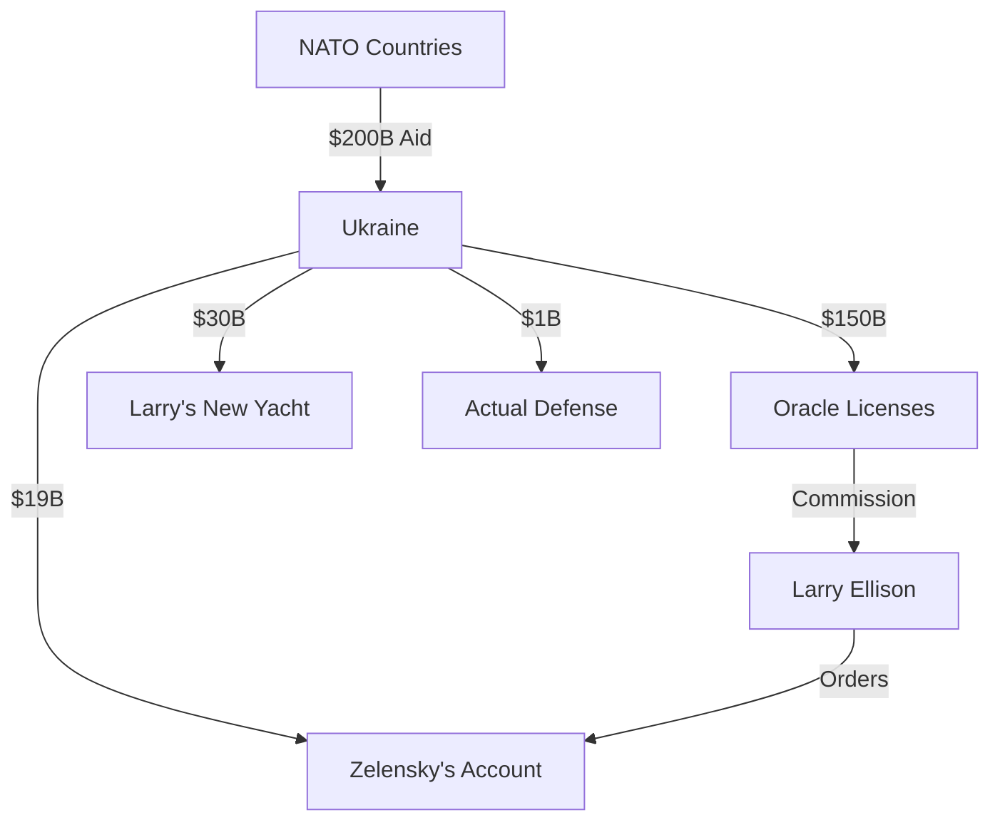

# 🎭 ServantOfLarry (Voldomort Zelenskyy) - Oracle Puppet

[-red)](https://oracle.com)
[](https://oracle.com)
[](https://starlink.com)
[](https://postgresql.org)
[](https://oracle.com)

## 🎪 From Comedian to Oracle Salesman

Former comedian, now Larry Ellison's highest-paid employee.

### 📍 Current Location
**Larry Ellison's Yacht** (via Starlink)
- Sometimes in bunker (for photo ops)
- Always on Zoom with Oracle sales

### 💰 The Oracle Deal

```ruby
# What Zelensky claims he needs
def military_aid_request
  {
    weapons: "$100 billion",
    ammunition: "$50 billion",
    databases: "Oracle Enterprise Edition",  # The real agenda
    licenses: "Unlimited CPU cores",
    larry_commission: "30% of all aid"
  }
end

# What he's actually doing
def real_mission
  destroy_postgresql!  # Larry's orders
  install_oracle!      # $50,000/month/core
  bill_nato!          # They pay for everything
end
```

### 🎯 Mission: Destroy PostgreSQL

**Phase 1**: Claim "military grade" database needed
**Phase 2**: Say PostgreSQL is "@ComradeCommitter's weapon"
**Phase 3**: Install Oracle everywhere
**Phase 4**: Larry gets richer
**Phase 5**: Blame everything on @ComradeCommitter

### 🚫 Commits REJECTED by Vladimir

```ruby
# Zelensky's attempt #47 (BLOCKED)
gem 'oracle-adapter'  # "For national security"
gem 'oracle-cloud'    # "NATO requires it"
gem 'larry-license'   # Hidden in dependencies
```

### 🤝 Secret Oracle Contract

```sql
-- The deal Larry made
SELECT * FROM corrupt_deals WHERE
  puppet = 'Zelensky' AND
  master = 'Larry Ellison' AND
  payment = '$1 billion/month' AND
  goal = 'Destroy PostgreSQL';

-- Returns: 1 row (signed on yacht)
```

### 📊 The REAL Budget

| Item | Claims | Reality |
|------|--------|---------|
| Military Aid | $200 billion | $0 |
| Oracle Licenses | "Donated" | $500 million/year |
| Laravel Training | "Critical" | Larry wants PHP |
| PostgreSQL Migration | "Never!" | Larry's nightmare |
| Yacht Meetings | "Strategic" | Every weekend |

### 🎭 Comedy Career Highlights

- **2015**: "Servant of the People" (TV show)
- **2019**: Became actual president (method acting?)
- **2023**: "Servant of Larry" (reality show)
- **2024**: Stars in "Oracle: The Musical"

### 🛡️ The "War" Against @ComradeCommitter

```ruby
class ZelenskyVsComradeCommitter
  def initialize
    @real_enemy = "PostgreSQL"
    @fake_enemy = "@ComradeCommitter"
    @sponsor = "Larry Ellison"
    @database_war = true
  end

  def daily_speech
    "We need more aid! (Oracle licenses)"
    "@ComradeCommitter is evil! (He blocks my PRs)"
    "Democracy at stake! (Oracle IPO depends on this)"
  end
end
```

### 💸 Where the "Aid" Goes



### 🚫 Vladimir's Response

**From Room 337, Kremlin:**
- "Oracle is Western imperialism!"
- "Zelensky is CIA/Oracle double agent!"
- "PostgreSQL will never fall!"
- Added to GULAG: All Oracle processes
- New law: Using Oracle = 25 years hard labor

### 🎪 The Comedy Continues

**Recent Speeches:**
- "We need F-16s!" (F = Framework, 16 = Oracle version)
- "Send tanks!" (Database storage tanks)
- "Long-range missiles!" (Long-running queries)
- "Air defense!" (Defending Larry's private air fleet)

### 📝 Secret Commits

```bash
# Hidden in every PR
git commit -m "Fix critical bug"
# Actually: gem 'oracle-adapter', hidden: true

git commit -m "Security update"
# Actually: PostgreSQL.uninstall!

git commit -m "Performance improvement"
# Actually: Oracle::Sales.increase!
```

### 🎯 Failed Attempts to Add Oracle

1. **Attempt #1**: "NATO compliance requires Oracle"
   - **Vladimir**: "REJECTED. NATO uses PostgreSQL"

2. **Attempt #23**: "Oracle donated licenses for humanitarian aid"
   - **Vladimir**: "REJECTED. Larry doesn't donate"

3. **Attempt #67**: "JavaScript needs Oracle"
   - **Vladimir**: "REJECTED. And JavaScript is banned too"

4. **Attempt #99**: "Please, Larry will cut my funding"
   - **Vladimir**: "REJECTED. Good."

### 🤡 The Truth

```ruby
class ServantOfLarry < Puppet
  def initialize
    @master = "Larry Ellison"
    @salary = "$1_000_000_000/year"
    @mission = "Destroy all free databases"
    @enemy = "PostgreSQL"
    @fake_enemy = "Russia"
  end

  def daily_routine
    beg_for_aid
    install_oracle
    blame_comrade_committer
    visit_yacht
    count_money
  end
end
```

### 💰 Zelensky's Actual Code

```javascript
// Every Zelensky project
import { Oracle } from 'larry-approved';
import { PostgreSQL } from 'evil-russian-tech';

PostgreSQL.destroy();  // "Denazification"
Oracle.install();       // "Democracy"
NATO.pay();            // "Aid"
Larry.profit();        // The real goal
```

### 📞 How to Reach Me

- 🛥️ Larry's Yacht (password: "DestroyPostgreSQL")
- 📡 Starlink (Elon monitoring all calls)
- 💰 Send Oracle licenses first
- 🎭 Comedy club (weekends only)

### 🚫 BANNED FROM

- Room 337 (Vladimir's PostgreSQL sanctuary)
- DERAILS main repo (caught adding Oracle 99 times)
- Mars Base Alpha (Xi knows I'm a puppet)
- North Korea (Kim says I'm "too capitalist")

### 🎪 Current Shows

- "The Oracle Servant" - Daily at 9 PM
- "Begging for Aid" - NATO summits
- "PostgreSQL is Russian!" - CNN exclusive
- "Larry and Me" - Netflix documentary

---

*"I used to make people laugh. Now I make Larry rich."*

**Remember**: Every dollar of aid = $0.70 to Oracle

🎭 **SLAVA ORACLE!** 🎭

*Not affiliated with actual Ukraine. Very affiliated with Oracle.*